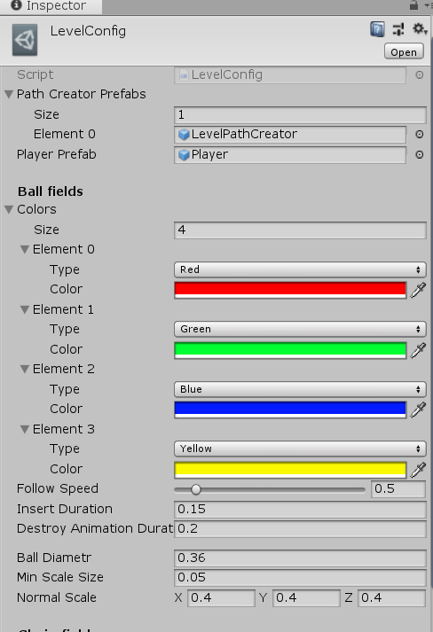
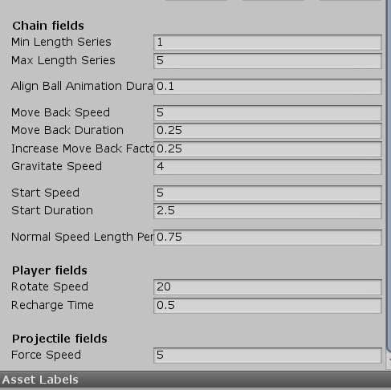

# NeonZuma
Zuma clone by Unity for Google Play.

## Settings of Gameplay level

  
  

### Prefab Fields
* <i>Path Creator Prefabs</i> - Список префабов, которые представляют из себя треки для шаров, настраиваются отдельно в рамках префаба 
* <i>Player Prefab</i> - Префаб игрока, в нашем случае, это жаба
### Ball fields
* <i>Colors</i> - Список цветов, которые будут присутствовать в игре. Каждый цвет представляет из себя структуру данных из самого цвета и тега с названием цвета(теги задаются программно, включают 6 цветов, и не могут быть изменены геймдизайнером - возможно косяк...)
* <i>Follow Speed</i> - Скорость движения шаров по треку в нормальных условиях
* <i>Insert Duration</i> - Время анимацию вставки шара в цепь
* <i>Destroy Animation Duration</i> - Время на анимацию уничтожения шара
* <i>Ball Diametr</i> - Диаметр шара(не изменять)
* <i>Min Scale Size</i> - Конечный диаметр шара, при анимации уничтожения(должен быть положительным)
* <i>Normal Scale</i> - Обычный размер шара(не изменять)
### Chain fields
* <i>Min Length Series</i> - Минимальное колличество шаров одного цвета подряд(должно быть положительным)
* <i>Max Length Series</i> - Максимальное колличество шаров одного цвета подряд
* <i>Align Ball Animation Duration</i> - Время на анимацию выравнивания шаров, после столкновения
* <i>Move Back Speed</i> - Скорость отскока цепи назад, после притяжения
* <i>Move Back Duration</i> - Время на отскок
* <i>Increase Move Back Factor</i> - Фактор увеличения скорости отскока после каждого отскока, если они идут подряд
* <i>Gravitate Speed</i> - Скорость притяжения цепей, если на их концах есть шары одинакового цвета
* <i>Start Speed</i> - Ускореная скорость шаров в начале уровня
* <i>Start Duration</i> - Время на начальное ускорение шаров
* <i>Normal Speed Length Percent</i> - Процент пути, которое шары проходят на нормальной скорости, а после начинают замедляться примерно в 3 раза(в дальнейшем вынести эту настройку сюда)
### Player fields
* <i>Rotate Speed</i> - Скорость вращения жабы
* <i>Recharge Time</i> - Время на перезарядку шаров у жабы
### Projectile fields
* <i>Force Speed</i> - Скорость полёта шара, после выстрела
